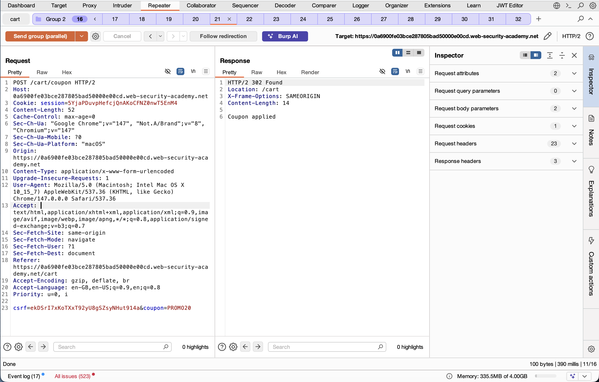
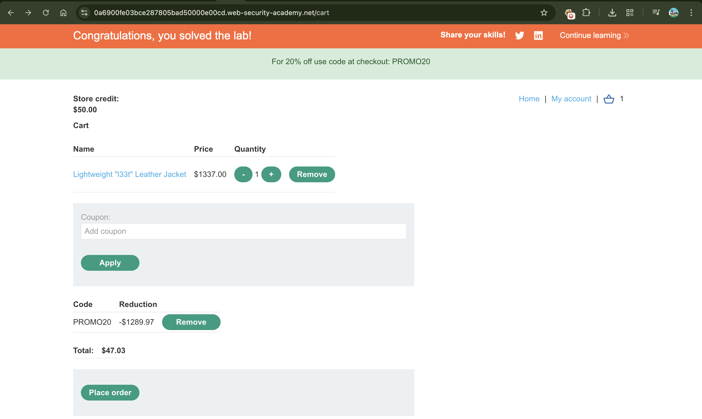
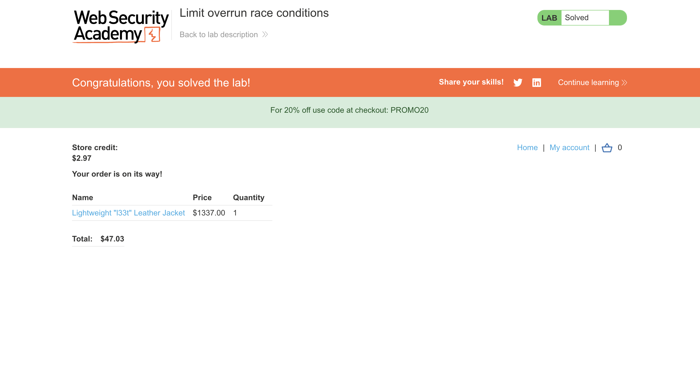

# Race Condition in Coupon Application leads to Discount Stacking

---

## 📌 Summary

A race condition exists in the `/cart/coupon` endpoint that allows multiple concurrent requests to apply the same coupon more than once.  

By exploiting the time gap between coupon validation and application, an attacker can repeatedly apply discounts and significantly reduce the final purchase price.

---

## 🧾 Description

The vulnerability is caused by a non-atomic "check-then-update" operation in the coupon handling logic.

When a coupon is applied, the system first checks whether the coupon has already been used. However, there is a small race window between this validation step and the database update.

By sending multiple concurrent requests before the state is updated, the same coupon can be applied multiple times successfully.

This results in unintended discount stacking and incorrect price calculation.

---

## 🔁 Steps to Reproduce

1. Login to the application with a valid user account  
2. Add the product **"l33t Leather Jacket ($1337.00)"** to the cart  
3. Intercept the request `POST /cart/coupon` using Burp Suite  
4. Send the request to **Repeater**  
5. Create multiple identical requests (e.g., 20–30 copies)  
6. Use **"Send group in parallel"** feature in Burp Suite  
7. Observe that multiple coupon applications are accepted  
8. Check the cart total — the final price is significantly reduced  

---

## 📸 Proof of Concept (PoC)

### 1. Parallel Requests Execution

### 2. Server Responses Showing Success

### 3. Final Cart Price After Exploit

---

## 💥 Impact

This vulnerability allows an attacker to apply multiple discounts on a single purchase by exploiting a race condition.

As a result:
- Users can purchase expensive items at a heavily reduced price or for almost free  
- The business suffers direct financial loss due to invalid discount stacking  
- Promotional and coupon systems can be abused at scale  

---

## 🛠️ Remediation

To fix this issue:

- Implement atomic database transactions for coupon validation and application  
- Use proper locking mechanisms to prevent concurrent state modification  
- Ensure coupon usage is validated and updated in a single operation  
- Add server-side rate limiting to reduce parallel request abuse  

---

## 📚 Notes

This issue demonstrates a classic **race condition (TOCTOU - Time of Check to Time of Use)** vulnerability where concurrent execution leads to inconsistent application state.