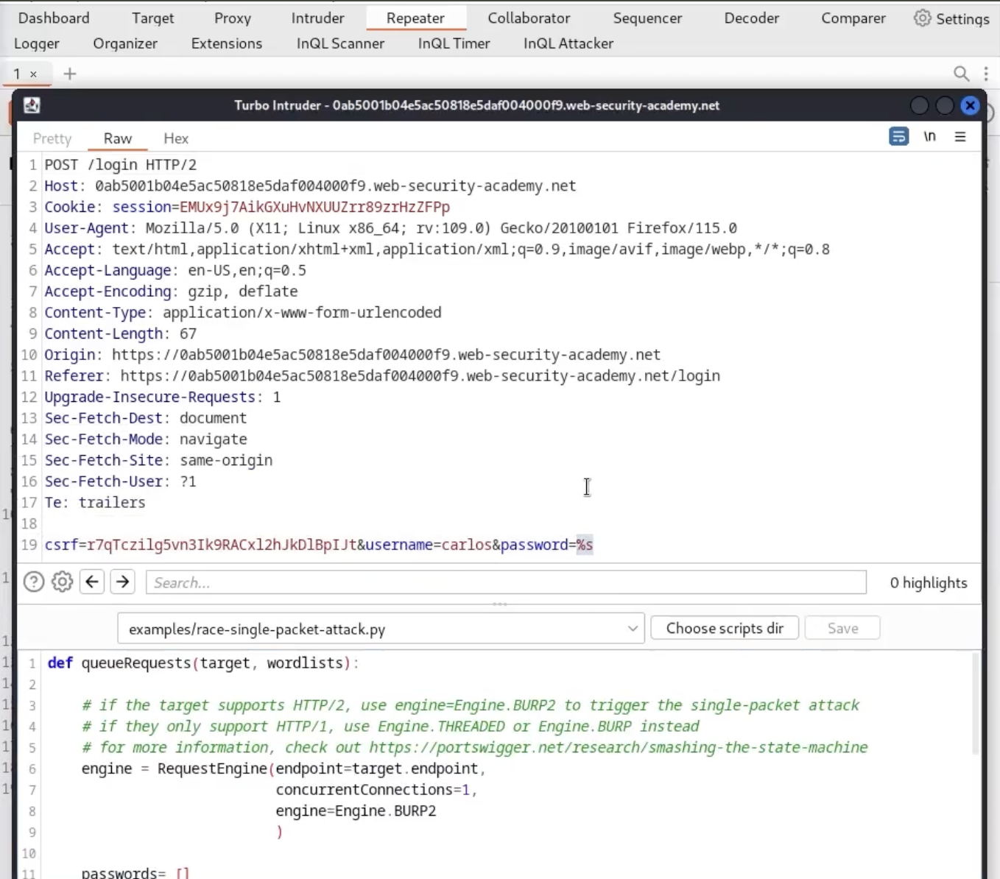
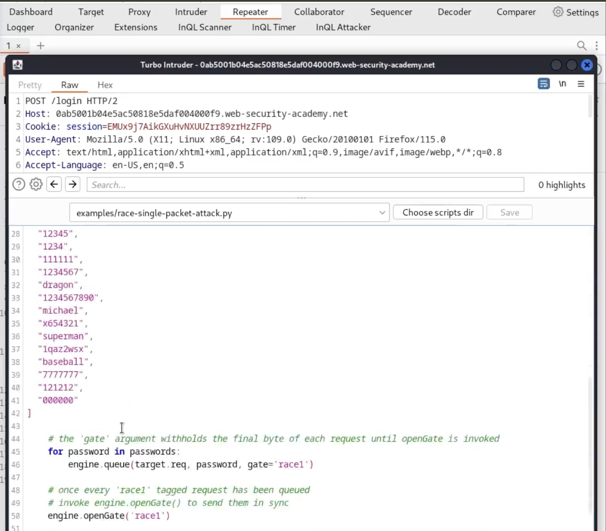
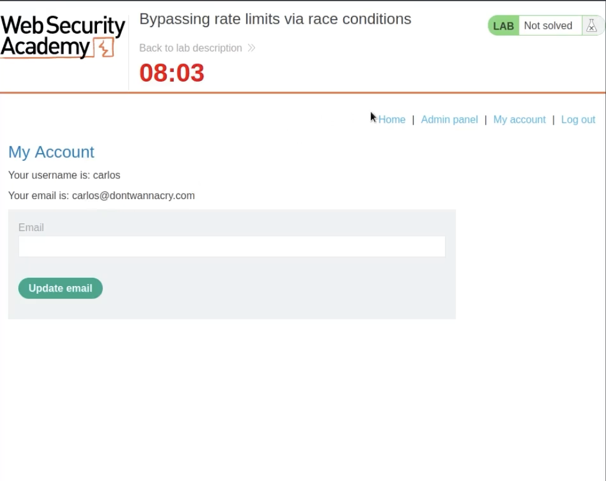
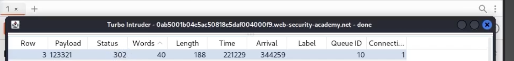
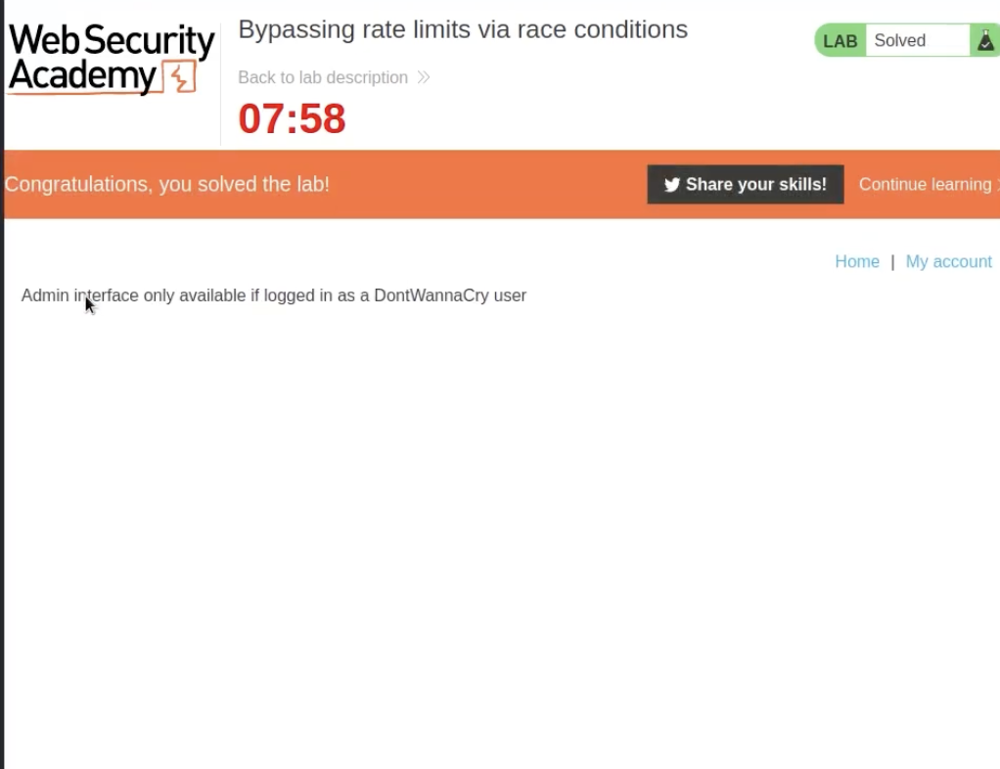

# Bypassing Rate Limits via Race Conditions

## 📌 Summary
The login mechanism of the application implements a rate limit to prevent brute-force attacks. However, a race condition in the rate limit counter allows an attacker to process multiple login attempts simultaneously before the account lock is triggered.

By using a single-packet attack (HTTP/2), an attacker can send a large batch of passwords in a single window, successfully brute-forcing the account despite the protection.

---

## 🧾 Description
The vulnerability occurs because the **"check"** (is the user locked?) and the **"update"** (increment failed attempts) are not handled atomically.

There is a small race window between:
- When a login request is processed
- When the database updates the failed attempt count

If multiple requests reach the server within this tiny time window, they all bypass the rate limit check.

---

## 🔁 Steps to Reproduce

1. Identify the target account (`carlos`) and prepare a list of possible passwords.

2. Intercept the `POST /login` request using Burp Suite and send it to **Turbo Intruder**.

3. In the request editor:
   - Set `username = carlos`
   - Replace the password value with `%s` (payload placeholder)

4. Select the script template:
  - The python code provided by the Portswigger academy lab

5. Configure the script:
- Queue all password candidates
- Use the same **gate** to synchronize requests

6. Execute the attack:
- All requests are sent simultaneously using HTTP/2

7. Analyze results:
- Look for **302 Redirect** responses (indicates successful login)

8. Use the correct password to:
- Log in
- Access the admin panel
- Delete the target user

---

## 📸 Proof of Concept (PoC)

### 1. Account Details and Target

### 2. Turbo Intruder Configuration

### 3. Race Single-Packet Script

### 4. Successful Brute-force Result

### 5. Lab Solved

---

## 🛠️ Remediation

### 1. Atomic Counters
Ensure that:
- Rate limit check
- Failed attempt increment  
are executed as a **single atomic transaction**.

### 2. Strict Rate Limiting
Apply rate limiting at infrastructure level:
- Web server 
- WAF 
This reduces reliance on application-layer logic.

### 3. Centralized State Management
Use a fast key-value store like **Redis**:
- Track attempts globally
- Use atomic operations like `INCR`
