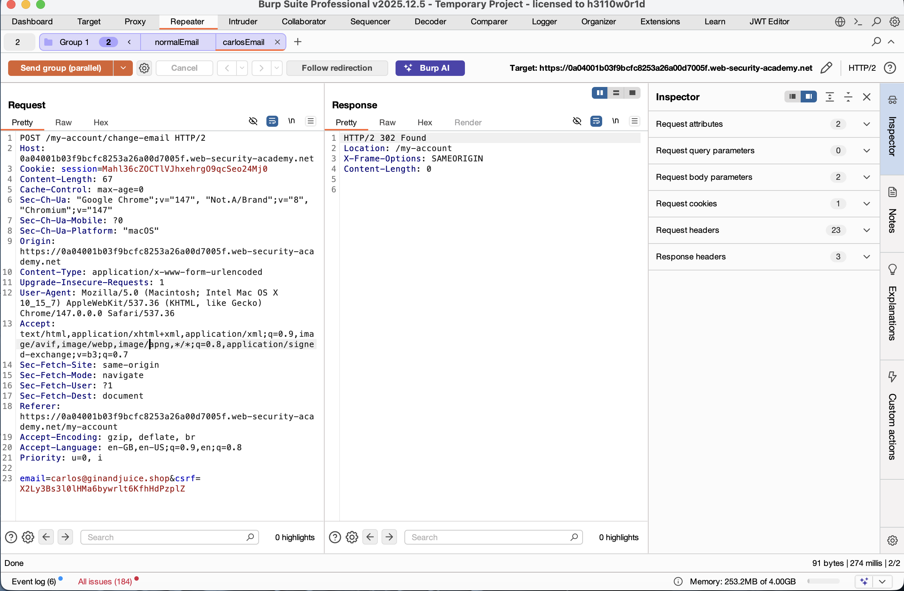
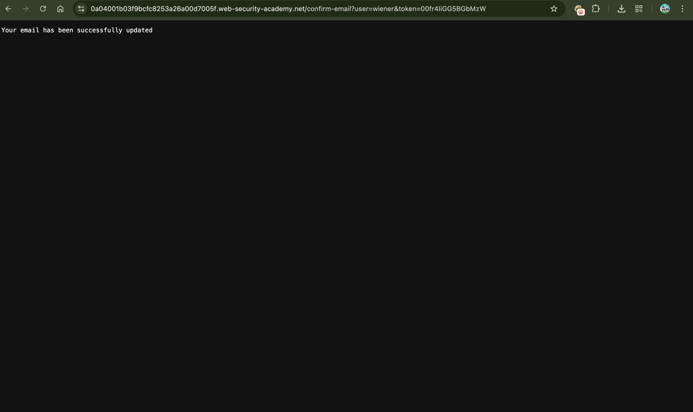
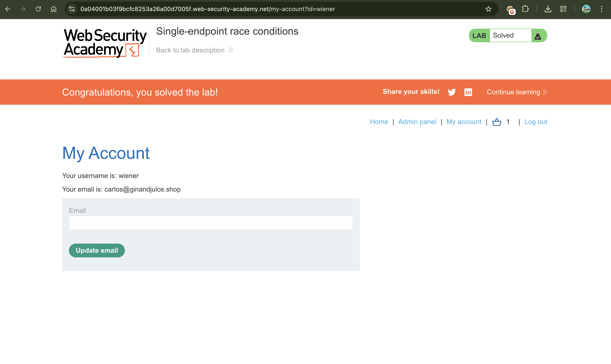
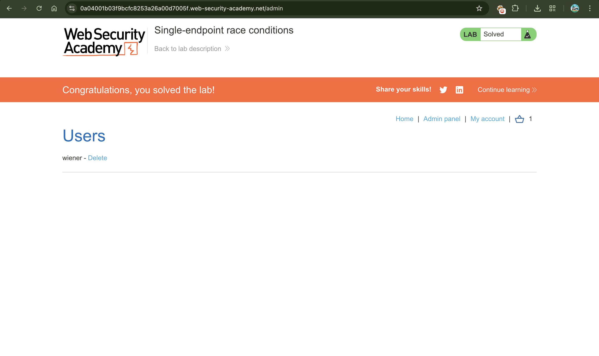

# Single Endpoint Race Conditions

## 📌 Summary

The application's email change functionality is vulnerable to a race condition. When a user initiates an email change, the system temporarily stores the new email before sending a confirmation link.

By sending multiple requests simultaneously (parallel requests), an attacker can create a collision. This results in receiving a confirmation link for an admin email (`carlos@ginandjuice.shop`) on their own account, ultimately leading to full account takeover and admin access.

---

## 🧾 Description

The vulnerability exists due to non-atomic execution of two critical steps:

1. The application stores the **"Pending Email"** in the database.
2. It retrieves that email to send a confirmation message.

There is a **race window** between these steps. If a second request modifies the "Pending Email" while the first request is still processing, the confirmation link for the second email may be sent to the first email’s inbox.

---

## 🔁 Steps to Reproduce

### 1. Analyze Behavior

* Log in using:

  ```
  Username: wiener
  Password: peter
  ```
* Attempt to change the email.
* Observe that a confirmation link is sent to the provided email address.

### 2. Setup Burp Suite

* Intercept the request:

  ```
  POST /my-account/change-email
  ```
* Send the request to **Repeater**.

### 3. Create a Request Group

* Create two tabs within a group:

**Tab 1:**

```
email=attacker@exploit-server.net
```

**Tab 2:**

```
email=carlos@ginandjuice.shop
```

### 4. Trigger the Race Condition

* Set send mode to:

  ```
  Send group in parallel
  ```
* Execute both requests simultaneously.

### 5. Capture the Token

* Check the exploit server email inbox.
* Look for an email sent to your address but containing a confirmation link intended for:

  ```
  carlos@ginandjuice.shop
  ```

### 6. Exploit

* Click the confirmation link.
* Your account email will now be changed to the admin email.

### 7. Privilege Escalation

* Refresh the application.
* An **Admin Panel** link will appear due to ownership of the admin email.

### 8. Final Action

* Access the Admin Panel.
* Delete the user:

  ```
  carlos
  ```

---

## 📸 Proof of Concept (PoC)

### 1. Parallel Request Configuration

* Multiple requests sent simultaneously using HTTP/2.


### 2. Successful Email Update

* Confirmation link intercepted successfully.


### 3. Admin Panel Access

* Admin privileges gained after email change.


### 4. Lab Solved

* Target user deleted from admin panel.


---

## 🛠️ Remediation

### 1. Atomic Database Operations

* Use transactions to ensure both storing and sending email operations are executed atomically.
* Prevent intermediate state modification.

### 2. Token Binding with Email

* Embed the target email inside a signed/encrypted confirmation token.
* Avoid relying on mutable database state.

### 3. Concurrency Control

* Restrict multiple simultaneous email change requests for the same user/session.
* Implement request locking or queuing mechanisms.

---

## ⚠️ Impact

* Account takeover
* Privilege escalation
* Unauthorized admin access
* Potential data loss or manipulation

---

## ✅ Conclusion

This vulnerability arises from improper handling of concurrent requests and lack of atomic operations. Fixing the race condition and securing token generation mechanisms will eliminate the risk of unauthorized privilege escalation.
