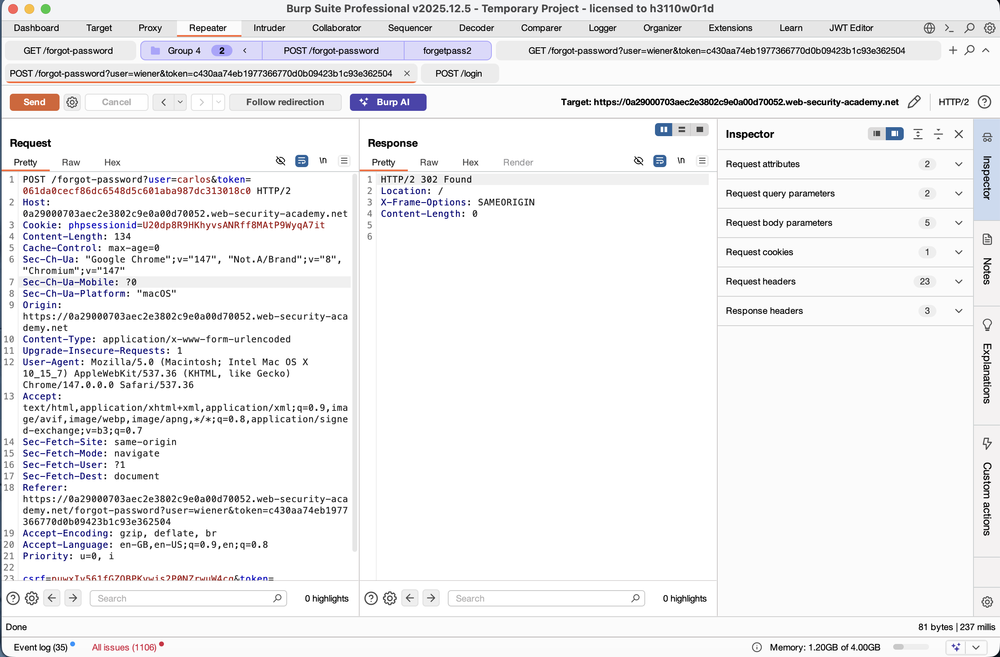
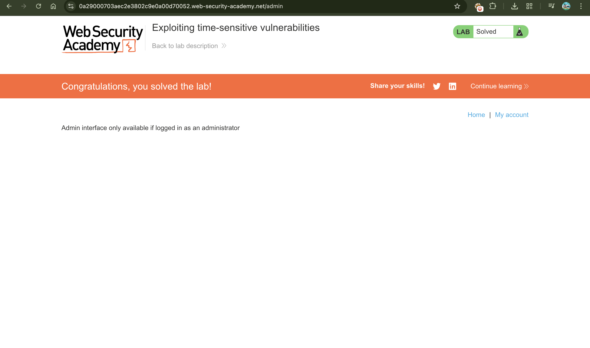

# Exploiting Time Sensitive Vulnerabilities

---

## 📌 Summary

I discovered that the application’s password reset mechanism is vulnerable to a time-based cryptographic flaw. Instead of generating a truly random secret, the server creates reset tokens based on the system’s timestamp. 

By using a **single-packet attack** to bypass session locking, I was able to sync my request with a request for another user (`carlos`). This forced the server to generate identical tokens for both accounts, allowing me to hijack Carlos's password reset link and take over his account.

---

## 🧾 The Vulnerability

The core issue here is **broken cryptography**. The "random" tokens aren't actually random—they are deterministic. The server likely uses a formula similar to:

```
token = hash(current_timestamp + maybe_some_other_static_data)
```

While PHP usually locks sessions to process requests one-by-one, this protection doesn't apply if the requests come from different sessions. By sending two requests at the exact same millisecond from different sessions, I exploited a "collision" where two different users end up with the same reset token.

---

## 🔁 Steps to Reproduce

### 1. Spotting the Pattern
I started by requesting a few resets for my own account (`wiener`). Even though the tokens looked random, the fact that they changed every time—and the site uses PHP—suggested they might be tied to the server's clock.

### 2. Splitting Sessions
I realized that if I used the same session, the server would just queue my requests. To get them to process at the exact same time, I grabbed a second session cookie and CSRF token.

### 3. The Race
I set up a **Tab Group** in Burp Repeater:
- **Request A:** Reset password for `wiener` (my account)
- **Request B:** Reset password for `carlos` (target)

### 4. The Execution
Using Burp’s **Parallel Send (single-packet attack)**, I fired both requests. This ensures they hit the server's backend logic at the exact same moment.

### 5. The Swap
I checked my own email and got a reset link. I then performed a "parameter swap":

- **Original:** `?token=XYZ&username=wiener`  
- **Modified:** `?token=XYZ&username=carlos`

### 6. Final Takeover
The modified link worked. I reset Carlos’s password, logged in, and accessed the admin panel to delete his account.

---

## 📸 Proof of Concept (PoC)

### 1. Synchronizing Requests in Burp
I used the Repeater group feature to align the two different sessions.  

### 2. Matching Timestamps
When the response times matched perfectly, I knew the tokens would be identical.  


### 3. Success Confirmation


---

## 🛠️ How to Fix It

- **Stop Using Timestamps:** Never use system time as a source of randomness for security tokens. It’s too easy to guess or exploit via race conditions.  
- **Use CSPRNG:** Use a proper **Cryptographically Secure Pseudo-Random Number Generator**. In PHP, this would be `random_bytes()` or `openssl_random_pseudo_bytes()`.  
- **Add Entropy:** Ensure each token is long, unique, and securely stored in the database mapped to a specific user, so one user's token can't be used for another account.

---