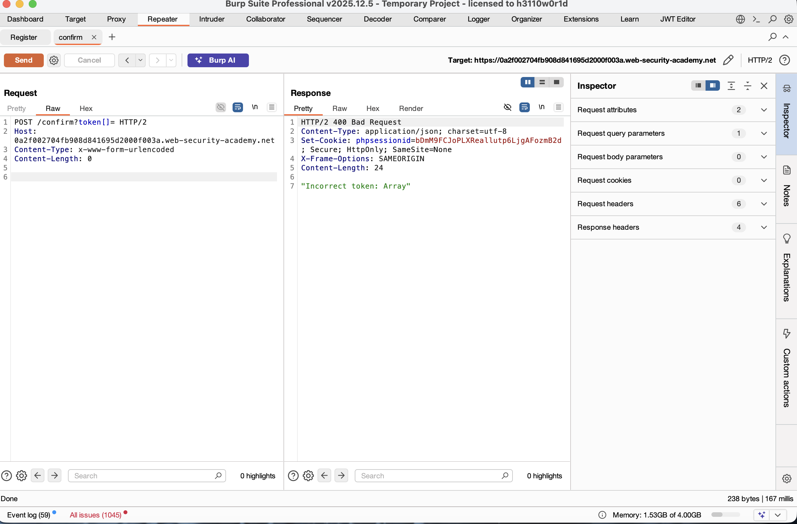
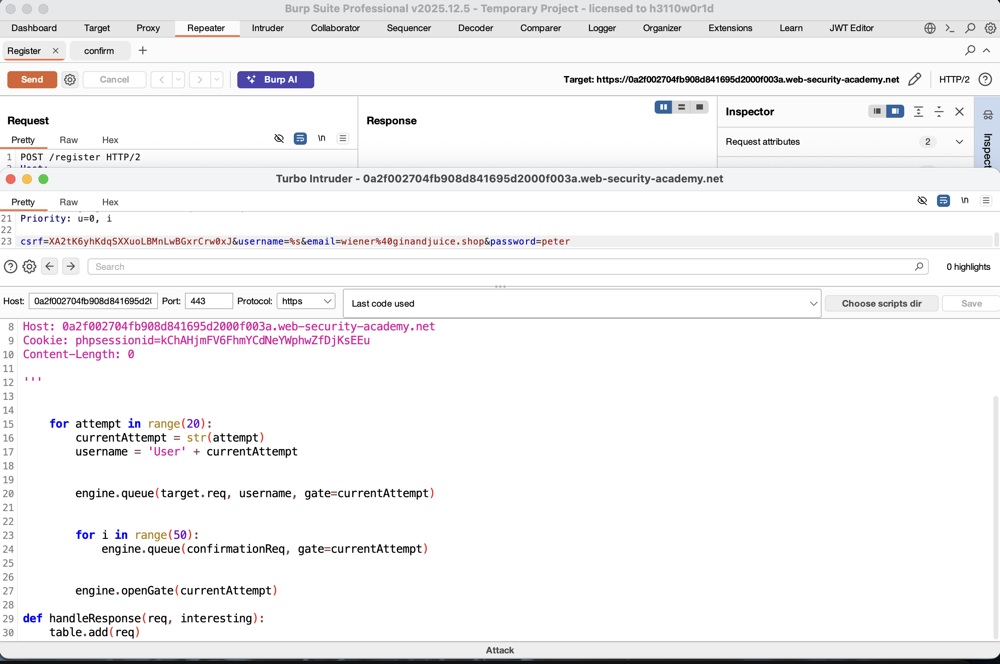
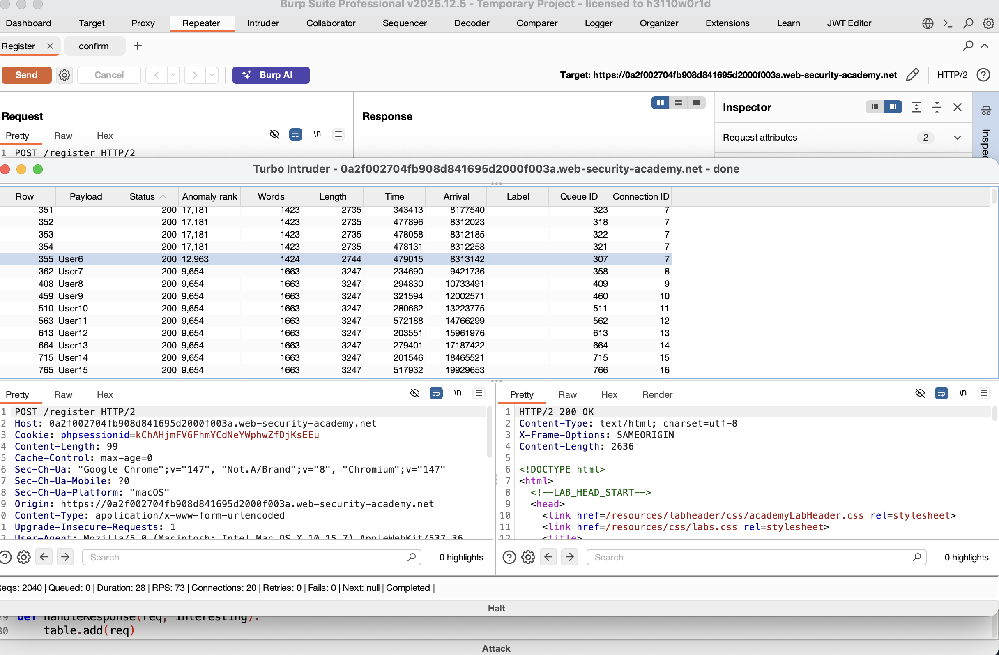

# Exploiting Partial Construction Race Conditions

## 📌 Summary
I discovered a race condition in the user registration process that allows for a partial construction exploit. This happens when an application creates a database record in stages—first creating the user, then generating a security token.

By sending a confirmation request at the exact moment a new user is being created, I verified the account using a "null" token before the server finished storing the real one. This allowed me to register an unauthorized `@ginandjuice.shop` email, bypass verification, and delete the user `carlos`.

---

## 🧾 The Vulnerability
The vulnerability exists in a tiny race window between the server receiving a registration request and the database saving the verification token.

- **The "Sub-state":** For a few milliseconds, a user exists in the database with an uninitialized or null token.  
- **The Logic Flaw:** If a confirmation request arrives during this window, the application compares the user's provided token against that null value.  
- **The Bypass:** Using an empty array (`token[]=`) can sometimes match an uninitialized value in the backend, successfully "verifying" the account.

---

## 🔁 Steps to Reproduce

### 1. Finding the Confirmation Logic
I analyzed the site’s JavaScript (`/resources/static/users.js`) and found that the final confirmation is a POST request to `/confirm?token=...`. I experimented with the parameter and found:

- **Empty Token:** Returned a Forbidden response, suggesting a patch was in place.  
- **Empty Array:** Sending `token[]=` returned `"Invalid token: Array"`, proving the server could process non-string inputs.  


---

### 2. Identifying the Race Window
I noticed the registration request took much longer to process than the confirmation request. To hit the race window, I had to:

- Delay the confirmation request, or  
- Flood the server so that one request lands exactly when the user record is partially built  

---

### 3. Setting Up Turbo Intruder
I sent the registration request to the Turbo Intruder extension and used a Python script to automate the race:

- **Registration:** Queued a registration for a new username (e.g., `User1`, `User2`)  
- **Flood:** Immediately queued 50 confirmation requests using `token[]=` for that same user  
- **Gate:** Used a "single-packet attack" to release all 51 requests at the exact same moment  


---

### 4. Catching the Collision
I ran 20 attempts of this race condition:

- Most attempts failed  
- One attempt (`User6`) successfully hit the race window  

The server responded with:
```
200 OK - Account registration for user User6 successful
```


---

### 5. Final Takeover
After successful verification:

- Logged in as `User6`  
- Accessed the admin panel  
- Deleted the user `carlos`  

---

## 📸 Proof of Concept (PoC)

### 1. Testing Parameter Types
Confirmed server behavior when receiving an array instead of a string token.  


### 2. The Race Script
Python script used to synchronize registration and confirmation flood.  


### 3. Successful Bypass
Response showing `200 OK` for an invalid confirmation request.  


---

## 🛠️ How to Fix It

- **Atomic Operations:**  
  Use database transactions so that user creation and token generation happen together. A user should never exist with a null token.

- **Non-Nullable Fields:**  
  Ensure the token column is `NOT NULL` and is assigned a secure random value immediately upon creation.

- **Strict Validation:**  
  Validate the token parameter strictly:
  - Must be a string  
  - Must match expected length/format  
  - Reject arrays, objects, or malformed inputs  

---